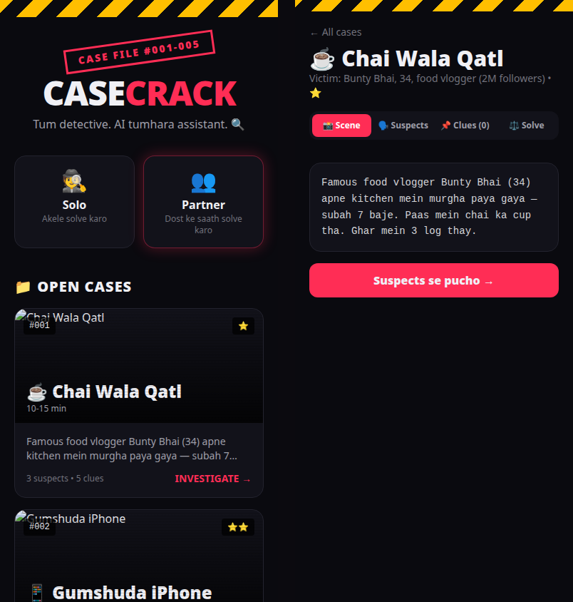

# 🕵️ CaseCrack

**Desi crime cases. Roman Urdu interrogation. Tum detective ho.**

5 hand-written mystery cases — chai wale ka qatl, gumshuda iPhone, dulhan ka haar, professor ka zeher, aur Rs 2 crore ki bank chori. Crime scene dekho, suspects se pooch-taach karo (AI, Roman Urdu mein jawab deta hai), clues pin karo, aur mujrim par ungli uthao.

**🎮 Live demo:** https://iamcipherdev.github.io/casecrack/



## 📁 The 5 Cases

| # | Case | Difficulty |
|---|------|-----------|
| 1 | ☕ Chai Wala Qatl — food vlogger ka zeher qatl | ⭐ |
| 2 | 📱 Gumshuda iPhone — cafeteria se phone gayab | ⭐⭐ |
| 3 | 💎 Dulhan Ka Haar — Rs 15 lakh haar chori | ⭐⭐⭐ |
| 4 | 🧪 Professor Ka Zeher — thermos dhakkan mein zeher | ⭐⭐⭐⭐ |
| 5 | 💰 Midnight Paisa — Rs 2 crore bank chori | ⭐⭐⭐⭐⭐ |

## ✨ Features

- **Solo mode** — akele case solve karo, apni speed par
- **AI suspect interrogation** — har suspect ki apni personality; Roman Urdu mein sawal-jawab
- **Clue pinning** — ahem clues ko pin karo, board par jama karo
- **Accusation flow** — mujrim choose karo, daleel do, result dekho
- **AI-generated crime scenes** — har case ki apni photorealistic scene image

## 🛠️ Tech

Next.js 16 (static export) · GitHub Pages · Pollinations free API (AI chat, client-side) · zero backend, zero cost

## 🗺️ Roadmap

- [ ] **Partner mode** — do log, apne-apne phones par, ek hi case ek saath solve karein
- [ ] More cases (community suggestions welcome)
- [ ] Leaderboard / solve-time tracking

## ▶️ Run locally

```bash
cd app
npm install
npm run dev
```

## 👤 Author

Built by **Cipher Developer** — https://github.com/iamcipherdev

*CaseCrack v1 — 5 Oct 2026. Partner mode coming soon.*
